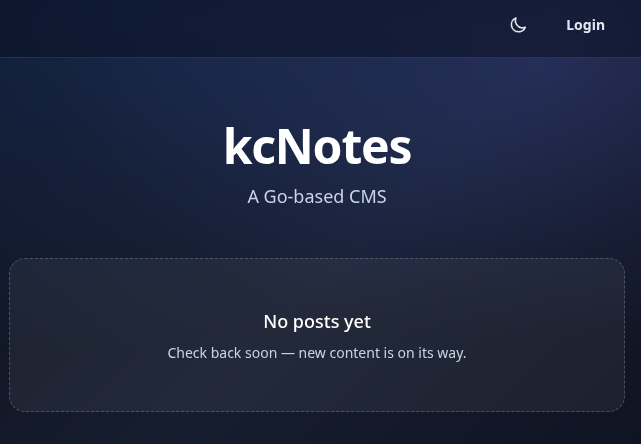

# kcNotes

kcNotes is content management system (CMS), written in Go + HTMX, with
container-driven workflows.

## Demo



## Features

- Server-rendered Go templates and HTMX admin flows.
- Self-hosted static assets and Tailwind CSS.
- SQLite/libSQL storage with local, remote Turso, and optional replica modes.
- Passkey-only admin auth, CSRF protection, RBAC, rate limiting, and account lockout.
- Posts/pages with edit-form autosave recovery, owner-scoped media uploads with
  generated image variants, settings, audit log, search, and static publishing.
- Root-owned Docker, Make, GitHub Actions, security scan, dependency update,
  and release integrity workflows.

## Quick Start

Run the following commands in a Terminal:

```bash
make css
make migrate
make run
make publish
make preview
make smoke
make stop
make clean
```

- `make run` and `make preview` expose the app on `http://localhost:5555` by default.
- If port `5555` is in use, the scripts try the next free port unless you set `HOST_PORT`
  - For example `HOST_PORT=8081 make run`.
- After `make run`, open `http://localhost:5555/admin/setup` to create the
  first admin account and passkey. Later sign-ins use passkeys only.

## Build Commands

Use `make help` as the source of truth.

Core app commands:

- `make build`: builds the development image and app.
- `make test`: runs Go tests.
- `make css`: builds Tailwind CSS.
- `make lint`: runs format and lint checks.
- `make migrate`: applies database migrations.
- `make run`: applies pending migrations, then starts the CMS.
- `make publish`: writes the static site and referenced media to `dist/site`
  unless `PUBLISH_OUT_DIR` is set.
- `make preview`: serves the published static site.
- `make smoke`: runs HTTP smoke probes.
- `make stop`: stops managed kcNotes containers.
- `make logs`: prints managed container logs.
- `make status`: shows the app image and managed containers.
- `make clean`: removes generated artifacts, caches, local DB files, and
  managed containers.

Maintenance commands:

- `make scan`: runs secret scanning and workflow policy checks.
- `make dist`: builds kcNotes release artifacts and integrity outputs under `dist/`.
- `make update`: refreshes pinned image digests and workflow allowlist docs.
- `make vendor-assets`: refreshes checked-in third-party static assets.
- `make renovate`: runs self-hosted Renovate.

## Public Routes

- Health: `http://localhost:5555/healthz`
- Robots guidance: `http://localhost:5555/robots.txt`
- Home: `http://localhost:5555/`
- Post: `http://localhost:5555/p/{slug}/`
- Page: `http://localhost:5555/page/{slug}/`

## Admin Routes

- Login: `http://localhost:5555/admin/login`
- First admin setup: `http://localhost:5555/admin/setup`
- Passkey enrollment: `http://localhost:5555/admin/enroll?token=...`
- Dashboard: `http://localhost:5555/admin`
- Posts: `http://localhost:5555/admin/posts`
- Existing post/page autosave: `POST /admin/posts/{id}/autosave`
- Autosave restore: `POST /admin/posts/{id}/autosave/restore`
- Autosave dismiss: `POST /admin/posts/{id}/autosave/dismiss`
- Media: `http://localhost:5555/admin/media`
- Users: `http://localhost:5555/admin/users`
- Passkeys: `http://localhost:5555/admin/passkeys`
- Settings: `http://localhost:5555/admin/settings`
- Audit log: `http://localhost:5555/admin/audit`

## Post Autosave

Existing post and page edit forms autosave private recovery snapshots after
changes settle for a few seconds. Autosave snapshots are per user and per post,
and they do not publish content or change the canonical post until the normal
`Save Changes` action is submitted.

If a newer snapshot exists when an editor is opened, the form shows a recovery
panel. `Restore Autosave` fills the editor with the snapshot while keeping the
canonical save action, and `Dismiss` removes that snapshot.

## Operational Observability

Serve mode writes structured operational logs for request and background
health. Each HTTP request logs method, matched route pattern, status,
duration, and request ID without logging user-controlled query strings or
private content.

The background metrics log summarizes in-process counters for HTTP status
classes and duration buckets, passkey login successes/failures, lockout and
rate-limit hits, job queue depth, total and per-type job run outcomes, and
database retry counts. These logs are intended for collection by the
deployment's normal log aggregation pipeline; kcNotes does not expose a public
metrics endpoint.

## CLI Modes

The root Make targets run these modes in the project container:

- `go run ./cmd/cms -mode serve`
- `go run ./cmd/cms -mode migrate`
- `go run ./cmd/cms -mode publish`
- `go run ./cmd/cms -mode preview`

## Admin Authentication

kcNotes admin access is passkey-only. Password login, password reset, TOTP,
recovery-code login, and `/admin/mfa` are not part of the active
authentication flow. Passkey setup, enrollment, and sign-in require WebAuthn
user verification, such as a device PIN or biometric check.

For a new database, run migrations and start the app, then open
`/admin/setup`. That route is available only while the users table is empty. A
successful setup creates the first admin user, stores the first WebAuthn
credential, and starts an admin session.

After setup, admins invite users from `/admin/users`. Each invitation creates a
single-use, expiring enrollment link for `/admin/enroll`; the invited user must
complete browser passkey enrollment before signing in.

Browsers require a secure WebAuthn context. Local development works on
`localhost`; the dev default allows ports `5555` through `5565` plus `8080`. If
you pin another local port, set `WEBAUTHN_ORIGINS` to that origin. Deployed
environments should serve admin routes over HTTPS and set the WebAuthn
relying-party values below.

## Operator Passkey Recovery

If every admin loses access to their passkeys, recover with database operator
access instead of adding a password or recovery-code login path. Prefer
restoring a known-good database backup first. If that is not available, issue a
new single-use enrollment invitation directly in the database, then complete
normal browser enrollment at `/admin/enroll`.

For the default local SQLite database, stop the app and back up the database
before editing it:

```bash
make stop
cp src/data/cms.db "src/data/cms.db.$(date +%Y%m%d%H%M%S).bak"
```

Create a pending admin and invitation. Replace `operator@example.com` with the
operator email and set `DB_FILE` if the deployment uses a different local
database path:

```bash
DB_FILE="${DB_FILE:-src/data/cms.db}"
EMAIL="operator@example.com"
USER_ID="$(uuidgen)"
INVITE_ID="$(uuidgen)"
TOKEN="$(openssl rand -base64 32 | tr '+/' '-_' | tr -d '=')"
TOKEN_HASH="$(printf '%s' "$TOKEN" | sha256sum | awk '{print $1}')"
ADMIN_SQL="SELECT id FROM users WHERE role = 'admin' LIMIT 1;"
CREATED_BY="$(sqlite3 "$DB_FILE" "$ADMIN_SQL")"
: "${CREATED_BY:?no existing admin user found; use /admin/setup}"

sqlite3 "$DB_FILE" <<SQL
INSERT INTO users(id, email, password_hash, role, disabled)
VALUES ('$USER_ID', '$EMAIL', '', 'admin', 1);

INSERT INTO user_enrollment_invitations(
  id, user_id, token_hash, expires_at, created_by
)
VALUES (
  '$INVITE_ID',
  '$USER_ID',
  '$TOKEN_HASH',
  strftime('%Y-%m-%dT%H:%M:%fZ', 'now', '+7 days'),
  '$CREATED_BY'
);
SQL

printf 'Open /admin/enroll?token=%s\n' "$TOKEN"
```

Restart the app, open the printed enrollment link over the configured WebAuthn
origin, and finish passkey enrollment in the browser. The invitation is still
single-use and expiring; successful enrollment enables the user. Do not write
password hashes, clear existing passkeys, or disable WebAuthn checks as part of
recovery. For remote Turso/libSQL deployments, run the same SQL through the
provider's administrative SQL access after taking a backup or snapshot.

## Configuration

Common environment variables:

| Variable                           | Default                           | Description                                                                                    |
| ---------------------------------- | --------------------------------- | ---------------------------------------------------------------------------------------------- |
| `DB_MODE`                          | `local`                           | Database mode. Valid values: `local`, `remote`, `replica`.                                     |
| `DB_PATH`                          | `./data/cms.db`                   | Filesystem path for the database. Used by `local` and `replica`.                               |
| `DATABASE_URL`                     | —                                 | Required for `remote` and `replica` modes.                                                     |
| `DATABASE_AUTH_TOKEN`              | —                                 | Required for Turso/libSQL authentication when not embedded in `DATABASE_URL`.                  |
| `REPLICA_SYNC_INTERVAL`            | `2s`                              | Interval for syncing replica with remote.                                                      |
| `REPLICA_READ_YOUR_WRITES`         | `true`                            | Ensures reads reflect recent writes in replica mode.                                           |
| `SESSION_COOKIE_NAME`              | `cms_session`                     | Name of the session cookie.                                                                    |
| `CSRF_COOKIE_NAME`                 | `cms_csrf`                        | Name of the CSRF cookie.                                                                       |
| `ADMIN_COOKIE_PATH`                | `/admin`                          | Path scope for admin cookies.                                                                  |
| `SESSION_TTL`                      | `24h`                             | Session time-to-live.                                                                          |
| `COOKIE_SECURE`                    | `false` (dev), `true` (otherwise) | Whether cookies are marked as secure.                                                          |
| `UPLOAD_DIR`                       | `./data/uploads`                  | Directory for uploaded files (inside `src/` at runtime).                                       |
| `MEDIA_USER_QUOTA_BYTES`           | `209715200`                       | Per-user media storage quota in bytes.                                                         |
| `MEDIA_TOTAL_QUOTA_BYTES`          | `2147483648`                      | Total media storage quota in bytes.                                                            |
| `LOGIN_LOCKOUT_THRESHOLD`          | `8`                               | Failed login attempts before lockout.                                                          |
| `LOGIN_LOCKOUT_WINDOW`             | `15m`                             | Time window for counting failed login attempts.                                                |
| `LOGIN_LOCKOUT_DURATION`           | `15m`                             | Duration of account lockout after threshold is reached.                                        |
| `JOBS_POLL_INTERVAL`               | `15s`                             | Poll interval for background job claim/execution in serve mode.                                |
| `AUTOSAVE_RETENTION_DURATION`      | `720h`                            | Stale autosave retention window used by background cleanup jobs.                               |
| `AUTOSAVE_CLEANUP_INTERVAL`        | `1h`                              | Recurring cadence for autosave cleanup job execution.                                          |
| `WEBAUTHN_RP_ID`                   | `localhost` in dev                | WebAuthn relying party ID, usually the admin host without scheme or port.                      |
| `WEBAUTHN_RP_NAME`                 | `kcNotes`                         | Display name shown by browser passkey prompts.                                                 |
| `WEBAUTHN_ORIGINS`                 | derived from `SITE_BASE_URL`      | Comma-separated allowed origins, such as `https://cms.example.com`.                            |
| `WEBAUTHN_ATTESTATION_CONVEYANCE`  | `none`                            | Optional passkey attestation conveyance: `none`, `indirect`, `direct`, or `enterprise`.        |
| `WEBAUTHN_ALLOWED_AAGUIDS`         | —                                 | Optional comma-separated authenticator AAGUID allowlist for stricter passkey registration.     |
| `SITE_BASE_URL`                    | —                                 | Base URL used for canonical links, RSS, and sitemap generation.                                |
| `PUBLISH_OUT_DIR`                  | `../dist/site`                    | Output directory for published site (from inside `src/`).                                      |
| `PUBLISH_INCLUDE_DRAFTS`           | `false`                           | Whether to include draft content in published output.                                          |
| `PREVIEW_HTTP_ADDR`                | `:8080`                           | Address used by preview server (in container).                                                 |
| `TRUSTED_PROXY_CIDRS`              | —                                 | List of trusted proxy CIDR ranges.                                                             |
| `ENFORCE_TRUSTED_PROXY_CIDRS`      | —                                 | Whether to enforce trusted proxy CIDR checks.                                                  |

Keep WebAuthn attestation restrictions opt-in. `direct`, `enterprise`, and
AAGUID allowlists can block common platform passkeys and password-manager
passkeys when the browser or authenticator does not provide matching
attestation data. When `WEBAUTHN_ALLOWED_AAGUIDS` is set, credentials with an
all-zero AAGUID are rejected unless the all-zero AAGUID is explicitly allowed.

## Remote DB Examples

Remote Turso/libSQL mode:

```bash
export DB_MODE=remote
export DATABASE_URL='libsql://<db-name>-<org>.turso.io'
export DATABASE_AUTH_TOKEN='<token>'
make migrate
make run
```

Embedded replica mode:

```bash
export DB_MODE=replica
export DB_PATH=./data/replica.db
export DATABASE_URL='libsql://<db-name>-<org>.turso.io'
export DATABASE_AUTH_TOKEN='<token>'
export REPLICA_SYNC_INTERVAL=2s
export REPLICA_READ_YOUR_WRITES=true
make migrate
make run
```

## Smoke Checks

After deploy, run:

```bash
BASE_URL='https://admin.example.com' make smoke
```

## Current Actions

- `actions/attest-build-provenance@a2bbfa25375fe432b6a289bc6b6cd05ecd0c4c32`
- `actions/checkout@de0fac2e4500dabe0009e67214ff5f5447ce83dd`
- `actions/create-github-app-token@1b10c78c7865c340bc4f6099eb2f838309f1e8c3`
- `actions/upload-artifact@043fb46d1a93c77aae656e7c1c64a875d1fc6a0a`
- `docker/setup-buildx-action@4d04d5d9486b7bd6fa91e7baf45bbb4f8b9deedd`

### Allowlist Guidance

GitHub Actions must stay pinned by full commit SHA with a reviewed version
comment in workflow files. Run `make update` after changing workflow action
references so this list stays current.

## License

This project is free for personal use. Commercial usage requires a license.
See [`LICENSE.md`](LICENSE.md) for more details.
